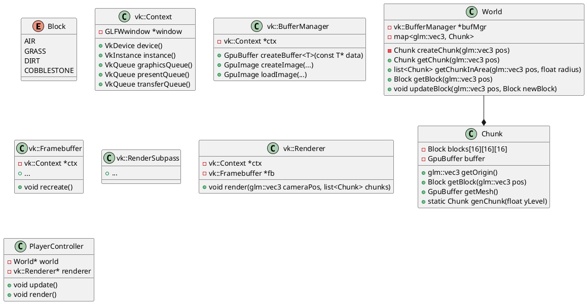

# Requirements
Requirements and goals of the project.

## Basic goals
- Simple terrain generation
- Be able to place and break blocks
  - 2-3 different available
- Simple physics
- Simple raycasting for block placement/breakage
- Rendering chunks with diffuse lighting model

## Optional goals
- Skybox rendering
- Shadow mapping
- Saving/loading maps

## Very optional goals
- NPCs? (le mucchine)

## UML
