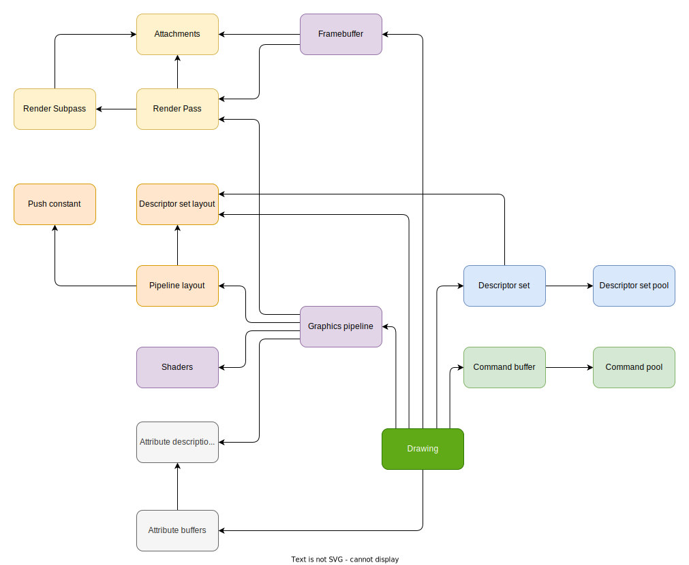

# Rendering
Stuff to get rendering working

## Render pass
A render pass represents a group of single render subpasses.

It also groups attachments info and subpass dependencies.

This is used to optimize for certain architectures which use tile based rendering, otherwise a bit pointless.

## Render subpass
Each render subpass represents the set of input and outputs of a full pipeline invocation (from vertex to final fragment output).

It lists all of the attachment references (actual attachments are specified in the render pass).

Attachments contain data about:
- Format
- Sample count
- Load/store operations (for example for transient attachments)
- Initial and final layout transitions (for reading/writing)

## Push constants
Push constants are used as a very speedy alternative to UBOs

## Descriptor set layout
Represents the layout of the descriptors used in a pipeline (so all the shaders combined). So not the actual data, just the "shape".

## Pipeline layout
Groups both push constants and descriptor set layout to form the full set of input layout of a given shader (just the uniforms though).

## Graphics pipeline
Represents the full state of the whole graphics pipeline.

Each pipeline is created for a specific render subpass (so that it knows about attachments data).

It also includes shaders, pipeline layout (for shader uniform inputs), attribute layout (for shader attribute inputs).

## Descriptor sets
Descriptor sets are allocated from a layout and a descriptor set pool.

Descriptor sets contain data about the actual values that uniforms should take.

Descriptor sets contain:
- Uniform buffers
- Image samplers
- Image views
- Combined image samplers and views

## Framebuffer
Framebuffer groups attachments for rendering in a specific render PASS (NOT SUBPASS). THE ORDER OF ATTACHMENTS MUST MATCH THAT OF THE RENDER PASS!!! That way they get correlated.

## Putting all of it together
In order to issue a draw command one must:
- Begin a render pass (this also binds a framebuffer)
- Bind a graphic pipeline
- Bind descriptor sets
- Bind necessary attribute buffers
- Set necessary push constants
- Set all of the dynamic state of the pipeline
- Draw!
- End the render pass